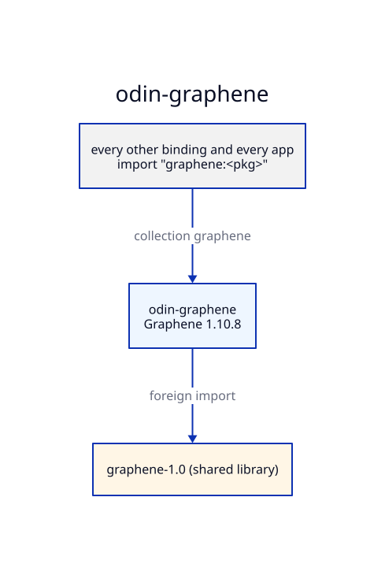

# Architecture — odin-graphene

## Generation

`make generate` runs runic over each package's `rune.yml`. The headers are /usr/include/graphene-1.0 and /usr/lib/x86_64-linux-gnu/graphene-1.0/include (libgraphene-1.0-dev), entered through `graphene-gobject.h`.
`scripts/postprocess.sh` then applies the rules in [PATCHED.md](PATCHED.md).
The output is committed, so consumers need neither runic nor the headers to build.

## Patches

Where runic gets a signature wrong, the fix is made by hand, listed in
[PATCHED.md](PATCHED.md), and pinned in `<pkg>/patched.odin` by a typed variable. A
regeneration that drops a patch then fails to compile.

## Collections

The collection `graphene` points at this repo's root. Packages import their siblings and the
bindings below them through collections, never by relative path.

